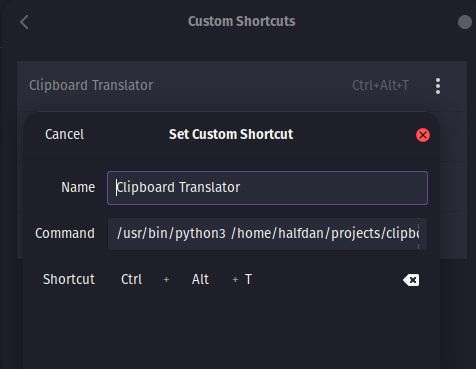

# Clipboard Translator

Clipboard Translator is a discrete Python utility designed to help students translate text directly from their clipboard without the need to open Google Translate in a web browser. This program automates the process of fetching text from the system's clipboard, translating it into a specified language, and then updating the clipboard with the translated text—all without any visible application interface. This makes it an ideal tool for environments where discreet usage of translation services is necessary.

---

## Installation
`sudo apt-get install xclip`

`git clone https://github.com/ha1fdan/clipboard-translator.git`

`cd clipboard-translator`

`pip install -r requirements.txt`

---

## PopOS Keyboard Shortcut (Keybind)

